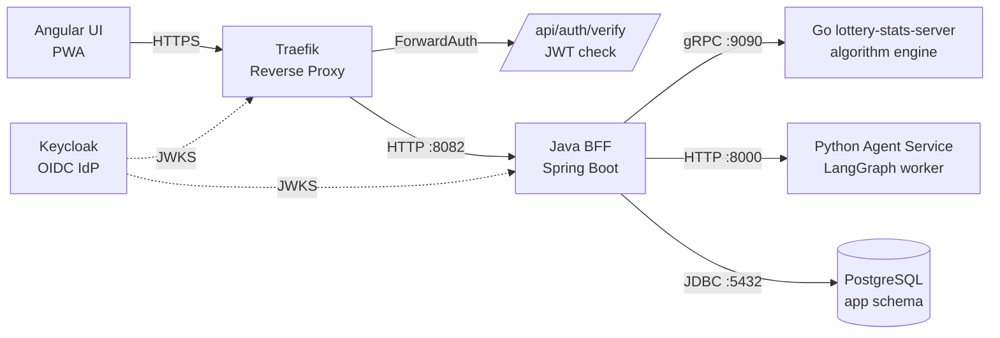

# Statistiloto Server (BFF)

Java Spring Boot BFF — OAuth2 Resource Server, REST API for the UI, gRPC client to the Go lottery service, owns the `app` DB schema.

## Tech Stack

| Component | Version / Library |
|---|---|
| Framework | Spring Boot 3.5.3 |
| Language | Java 21 |
| Build | Gradle Kotlin DSL |
| Security | Spring Security OAuth2 Resource Server (JWT) |
| ORM | Spring Data JPA / Hibernate |
| Migrations | Flyway |
| Database | PostgreSQL (shared, `app` schema) |
| gRPC | grpc-netty-shaded 1.68.2, protobuf 3.25.5 |
| API Docs | springdoc-openapi 2.6.0 (Swagger UI) |
| Boilerplate | Lombok |
| Tests | JUnit 5, Spring Boot Test, Testcontainers (PostgreSQL), MockWebServer |

## Architecture



The Angular UI talks **only** to the BFF. The BFF:

1. Validates the user's Keycloak-issued JWT on every request.
2. Proxies lottery computation requests to the Go service via gRPC.
3. Proxies agent chat/approve requests to the Python agent service via HTTP.
4. Reads and writes application data (user profiles, saved numbers) in the `app` schema of the shared PostgreSQL database.

## API Endpoints

| Method | Path | Auth | Description |
|---|---|---|---|
| POST | `/api/generate/form` | JWT | Generate lottery number combinations (proxied to Go via gRPC `GenerateForm`) |
| POST | `/api/generate/statistics` | JWT | Calculate frequent number pairs/groups (proxied to Go via gRPC `GetStatistics`) |
| POST | `/api/generate/analyze` | JWT | Analyze user-selected numbers against historical draws (proxied to Go via gRPC `Analyze`) |
| GET | `/api/user/numbers` | JWT | List the authenticated user's saved lottery numbers |
| POST | `/api/user/numbers` | JWT | Save a new set of lottery numbers for the authenticated user |
| DELETE | `/api/user/numbers/{id}` | JWT | Delete a saved numbers entry (ownership-checked) |
| GET | `/api/me` | JWT | Return the authenticated user's profile (sub, email, name, roles, archiveFrom, archiveTo); auto-creates `user_profile` row on first login |
| POST | `/api/agent/chat` | JWT | Proxy a chat request to the Python agent service (forwards JWT Bearer token) |
| POST | `/api/agent/approve` | JWT | Proxy an approval decision to the Python agent service |
| GET | `/api/agent/health` | JWT | Check agent service health |
| GET | `/api/agent/sessions` | JWT | List the caller's agent sessions |
| GET | `/api/agent/sessions/{sessionId}` | JWT | Get one agent session's history |
| DELETE | `/api/agent/sessions/{sessionId}` | JWT | Delete one agent session |
| DELETE | `/api/agent/sessions` | JWT | Delete all of the caller's agent sessions |
| GET | `/api/agent/llm-config` | JWT + ADMIN | Get the agent's active LLM configuration |
| PUT | `/api/agent/llm-config` | JWT + ADMIN | Update the agent's active LLM configuration |
| GET | `/api/agent/llm-configs` | JWT + ADMIN | List all stored LLM configurations |
| POST | `/api/agent/llm-configs` | JWT + ADMIN | Create a new stored LLM configuration |
| PUT | `/api/agent/llm-configs/{configId}/activate` | JWT + ADMIN | Activate a stored LLM configuration by id |
| POST | `/api/agent/llm-configs/{configId}/test` | JWT + ADMIN | Smoke-test a stored LLM configuration |
| DELETE | `/api/agent/llm-configs/{configId}` | JWT + ADMIN | Delete a stored LLM configuration |
| GET | `/api/agent/llm-models?provider=...` | JWT + ADMIN | List models available from a given LLM provider |
| GET | `/api/agent/token-usage` | JWT + ADMIN | Get agent token usage statistics |
| GET | `/api/agent/audit-log?limit=50` | JWT + ADMIN | Get agent audit log (optional `limit` query param, default 50) |
| POST | `/api/agent/reindex` | JWT + ADMIN | Trigger rebuild of the agent's pgvector RAG embeddings |
| GET | `/api/auth/verify` | Public | ForwardAuth endpoint for Traefik edge JWT validation; returns 200 if valid |
| GET | `/actuator/health` | Public | Spring Boot Actuator health check |
| GET | `/actuator/info` | Public | Application info |
| GET | `/swagger-ui.html` | Public | Swagger UI |
| GET | `/api-docs` | Public | OpenAPI spec |
| POST | `/api/feedback` | JWT | Submit user feedback or lottery suggestion |
| GET | `/api/feedback` | JWT + ADMIN | List all feedback entries |
| PUT | `/api/feedback/{id}/status` | JWT + ADMIN | Update feedback status (`new`/`read`/`archived`) |
| DELETE | `/api/feedback/{id}` | JWT + ADMIN | Delete a feedback entry |
| GET | `/api/user/simulations` | JWT | List the authenticated user's saved simulation results |
| POST | `/api/user/simulations` | JWT | Save a simulation result (request + summary JSON) |
| DELETE | `/api/user/simulations/{id}` | JWT | Delete a saved simulation result (ownership-checked) |
| PUT | `/api/me/archive` | JWT | Update the authenticated user's preferred archive date range |
| DELETE | `/api/me` | JWT | Soft-archive the authenticated user's account (sets `archived_at` on profile, saved numbers, saved simulations, feedback; Keycloak account is NOT deleted — re-login reactivates the profile with fresh defaults) |
| GET | `/api/admin/archived-users` | JWT + ADMIN | List all archived user profiles (for audit) |
| GET | `/api/admin/archived-users/{sub}` | JWT + ADMIN | Get details of a specific archived user |
| POST | `/api/agent/chat/stream` | JWT | Stream agent chat events via SSE (Redis pub/sub relay with inline SSE fallback) |

## Project Structure

```
server/
├── build.gradle.kts              # Gradle build (Spring Boot 3.5.3, Java 21, gRPC, Flyway)
├── settings.gradle.kts
├── Dockerfile                    # Multi-stage build (Gradle → eclipse-temurin:21-jre-alpine)
├── docs/
│   ├── REQUIREMENTS.md           # Functional and non-functional requirements
│   └── FLOWS.md                  # Mermaid sequence diagrams for key flows
└── src/
    ├── main/
    │   ├── java/com/statistiloto/server/
    │   │   ├── ServerApplication.java          # Spring Boot entry point
    │   │   ├── controller/
    │   │   │   ├── AgentController.java         # /api/agent/* — proxy to Python agent
    │   │   │   ├── AdminArchiveController.java  # /api/admin/archived-users — admin audit of archived accounts
    │   │   │   ├── GenerateController.java      # /api/generate/* — proxy to Go via gRPC
    │   │   │   ├── UserController.java          # /api/me, /api/me/archive, DELETE /api/me, /api/auth/verify
    │   │   │   └── UserNumbersController.java   # /api/user/numbers CRUD
    │   │   ├── service/
    │   │   │   ├── AgentClientService.java      # HTTP client to Python agent service
    │   │   │   ├── LotteryClientService.java     # gRPC client to Go lottery service
    │   │   │   ├── SavedNumbersService.java      # CRUD for saved_numbers
    │   │   │   └── UserProfileService.java       # Auto-create/reactivate user_profile, soft-archive
    │   │   ├── security/
    │   │   │   └── SecurityConfig.java           # OAuth2 Resource Server, stateless, role mapping
    │   │   ├── grpc/
    │   │   │   └── GrpcClientConfig.java         # ManagedChannel + blocking stub for Go service
    │   │   ├── entity/
    │   │   │   ├── Feedback.java                 # JPA entity (app.feedback)
    │   │   │   ├── SavedNumbers.java             # JPA entity (app.saved_numbers)
    │   │   │   ├── SavedSimulation.java          # JPA entity (app.saved_simulations)
    │   │   │   └── UserProfile.java              # JPA entity (app.user_profile)
    │   │   ├── repository/
    │   │   │   ├── FeedbackRepository.java       # Spring Data JPA repository
    │   │   │   ├── SavedNumbersRepository.java   # Spring Data JPA repository
    │   │   │   ├── SavedSimulationRepository.java # Spring Data JPA repository
    │   │   │   └── UserProfileRepository.java    # Spring Data JPA repository
    │   │   ├── dto/
    │   │   │   ├── request/                      # Inbound request DTOs (validated)
    │   │   │   └── response/                     # Outbound response DTOs (records)
    │   │   └── exception/
    │   │       ├── ErrorResponse.java            # Structured error body
    │   │       ├── GlobalExceptionHandler.java   # @RestControllerAdvice, maps gRPC/valid/auth errors
    │   │       └── RequestLoggingFilter.java     # Request logging filter
    │   └── resources/
    │       ├── application.yml                   # Configuration (env-driven)
    │       └── db/migration/
    │           ├── V1__create_app_schema.sql     # Flyway: creates app.user_profile + app.saved_numbers
    │           ├── V2__add_archive_window_to_user_profile.sql
    │           ├── V3__create_saved_simulations.sql
    │           ├── V4__create_feedback.sql
    │           └── V5__add_archived_at.sql       # Adds archived_at to all user-owned tables
    └── test/
        └── java/com/statistiloto/server/
            ├── ServerApplicationTests.java       # Context load test
            ├── controller/
            │   └── AgentControllerTest.java       # Agent controller tests
            └── service/
                └── AgentClientServiceTest.java    # Agent client service tests
```

## Quick Start

### Prerequisites

- Java 21 (JDK)
- Gradle 8.10+ (or use the included wrapper `./gradlew`)
- PostgreSQL (or run via Docker Compose from the repo root)
- Keycloak (for JWT issuance)
- Go lottery-stats-server (for gRPC endpoints)
- Python agent service (for agent endpoints)

### Build

```bash
./gradlew build
```

### Run (development)

```bash
./gradlew bootRun
```

The server starts on port `8082` by default (configurable via `SERVER_HTTP_PORT`).

### Test

```bash
./gradlew test
```

Tests use H2 for unit tests and Testcontainers (PostgreSQL) for integration tests. MockWebServer is used to mock the agent service.

## Environment Configuration

All configuration is environment-variable driven with sensible defaults for local development. See `src/main/resources/application.yml`.

| Environment Variable | Default | Description |
|---|---|---|
| `SERVER_HTTP_PORT` | `8082` | HTTP port the BFF listens on |
| `SERVER_PROFILE` | `dev` | Spring profile |
| `DB_HOST` | `localhost` | PostgreSQL host |
| `DB_PORT` | `5432` | PostgreSQL port |
| `DB_NAME` | `statistiloto` | PostgreSQL database name |
| `DB_USER` | `postgres` | PostgreSQL username |
| `DB_PASSWORD` | `postgres` | PostgreSQL password |
| `KEYCLOAK_JWKS_URL` | `http://auth:8080/auth/realms/statistiloto/protocol/openid-connect/certs` | Keycloak JWKS URI for JWT signature validation |
| `LOTTERY_GRPC_HOST` | `localhost` | Go lottery-stats-server gRPC host |
| `LOTTERY_GRPC_PORT` | `9090` | Go lottery-stats-server gRPC port |
| `AGENT_SERVICE_URL` | `http://agent:8000` | Python agent service base URL |
| `AGENT_READ_TIMEOUT_MS` | `300000` | Agent service HTTP read timeout (5 min default for LLM inference) |
| `REDIS_URL` | `redis://localhost:6379` | Redis URI for the agent SSE pub/sub relay (falls back to inline SSE if blank/unreachable) |

## Security

### OAuth2 Resource Server

The BFF is a **stateless** OAuth2 Resource Server. It validates Keycloak-issued JWTs (RS256) on every request.

- **JWKS validation**: Spring Security fetches public keys from the `KEYCLOAK_JWKS_URL` to verify JWT signatures. Using `jwk-set-uri` (instead of `issuer-uri`) avoids issuer mismatch when the internal container URL differs from the public URL.
- **Audience validation**: The Keycloak realm includes an `oidc-audience-mapper` on the `statistiloto-ui` client that adds `statistiloto-ui` to the `aud` claim of every access token. The BFF rejects tokens that don't contain this audience.
- **Session**: `SessionCreationPolicy.STATELESS` — no server-side sessions, no CSRF.
- **Role mapping**: Realm roles from `realm_access.roles` and groups from the `groups` claim are mapped to `ROLE_<NAME>` Spring Security authorities, enabling `@PreAuthorize("hasRole('ADMIN')")` on admin-only endpoints.

### Public Endpoints

The following endpoints are accessible without authentication:

- `/api/auth/verify` — Traefik ForwardAuth endpoint
- `/actuator/health`, `/actuator/info` — health checks
- `/swagger-ui/**`, `/api-docs`, `/v3/api-docs/**` — API documentation

All other `/api/**` endpoints require a valid JWT.

### ForwardAuth

Traefik's ForwardAuth middleware calls `/api/auth/verify` before forwarding requests to the BFF. If the JWT is valid, Spring Security has already authenticated the request and the endpoint returns `{ "authenticated": true, "sub": "...", "email": "..." }` with HTTP 200. If invalid, Spring Security returns 401 and Traefik blocks the request.

## Database

### Schema Ownership

The BFF owns the **`app`** schema in the shared PostgreSQL database. Keycloak owns identity (users, credentials, roles). The BFF stores only application data keyed by the Keycloak `sub` (subject) claim — no passwords, no user credentials.

### Flyway Migrations

Migrations are in `src/main/resources/db/migration/` and are applied automatically on startup. Current migrations: `V1__create_app_schema.sql`, `V2__add_archive_window_to_user_profile.sql`, `V3__create_saved_simulations.sql`, `V4__create_feedback.sql`, `V5__add_archived_at.sql`. Flyway is configured with:

- `schemas: app`
- `default-schema: app`
- `locations: classpath:db/migration`

Hibernate is set to `ddl-auto: validate` — it validates the entity mappings against the Flyway-managed schema but never modifies it.

### Tables

#### `app.user_profile`

| Column | Type | Notes |
|---|---|---|
| `sub` | TEXT | Primary key — Keycloak subject claim |
| `display_name` | VARCHAR(255) | Display name from JWT `name` or `preferred_username` |
| `archive_from` | DATE | Optional preferred archive window start |
| `archive_to` | DATE | Optional preferred archive window end |
| `archived_at` | TIMESTAMPTZ | Soft-archive timestamp (NULL = active; set by `DELETE /api/me`; cleared on re-login via `ensureProfile`) |
| `created_at` | TIMESTAMP | Row creation timestamp |
| `updated_at` | TIMESTAMP | Row update timestamp |

Auto-created on first login via `/api/me` and before any `saved_numbers` insert (to satisfy the FK constraint). On re-login after soft-archive, `ensureProfile` reactivates the profile with fresh defaults (old child records stay archived).

#### `app.saved_numbers`

| Column | Type | Notes |
|---|---|---|
| `id` | BIGSERIAL | Primary key |
| `user_sub` | TEXT | FK → `app.user_profile(sub)` ON DELETE CASCADE |
| `category` | VARCHAR(50) | User-defined category label |
| `numbers` | JSONB | Array of lottery numbers |
| `will_be` | JSONB | Optional "will be" (strong) numbers |
| `date_from` | DATE | Optional date window start |
| `date_to` | DATE | Optional date window end |
| `created_at` | TIMESTAMP | Row creation timestamp |
| `archived_at` | TIMESTAMPTZ | Soft-archive timestamp (NULL = active; set by `DELETE /api/me`) |

Indexes: `idx_saved_numbers_user_sub`, `idx_saved_numbers_category`, `idx_saved_numbers_archived` (partial, `WHERE archived_at IS NOT NULL`).

#### `app.saved_simulations`

| Column | Type | Notes |
|---|---|---|
| `id` | BIGSERIAL | Primary key |
| `user_sub` | VARCHAR(255) | FK → `app.user_profile(sub)` ON DELETE CASCADE |
| `request_json` | JSONB | Simulation request payload |
| `summary_json` | JSONB | Simulation summary payload |
| `created_at` | TIMESTAMPTZ | Row creation timestamp |
| `archived_at` | TIMESTAMPTZ | Soft-archive timestamp (NULL = active; set by `DELETE /api/me`) |

Indexes: `idx_saved_simulations_user_sub`, `idx_saved_simulations_archived` (partial, `WHERE archived_at IS NOT NULL`).

#### `app.feedback`

| Column | Type | Notes |
|---|---|---|
| `id` | BIGSERIAL | Primary key |
| `user_sub` | VARCHAR(255) | Optional submitter Keycloak subject |
| `type` | VARCHAR(50) | Feedback type (e.g. `general`) |
| `status` | VARCHAR(20) | `new`/`read`/`archived` |
| `page` | VARCHAR(255) | Page the feedback was sent from |
| `language` | VARCHAR(10) | UI language |
| `tier` | VARCHAR(20) | User tier |
| `message` | TEXT | Feedback message |
| `extra` | JSONB | Optional extra context |
| `created_at` | TIMESTAMPTZ | Row creation timestamp |
| `archived_at` | TIMESTAMPTZ | Soft-archive timestamp (NULL = active; set by `DELETE /api/me`) |

Indexes: `idx_feedback_status_created`, `idx_feedback_user_sub`, `idx_feedback_archived` (partial, `WHERE archived_at IS NOT NULL`).

## gRPC Client

The BFF connects to the Go `lottery-stats-server` via gRPC using a shared `ManagedChannel` configured in `GrpcClientConfig.java`.

- **Channel**: `ManagedChannelBuilder.forAddress(host, port).usePlaintext().build()` — plaintext is used because traffic stays within the Docker network.
- **Stub**: `LotteryServiceGrpc.LotteryServiceBlockingStub` — blocking calls for synchronous request/response.
- **Proto contract**: `proto/lottery.proto` at the repository root (shared between Java and Go). The protobuf Gradle plugin generates Java stubs from this file.
- **Lifecycle**: The channel is shut down gracefully on application stop (`@PreDestroy`, 5-second await).

### gRPC Methods

| BFF Endpoint | gRPC RPC | Proto Request | Proto Response |
|---|---|---|---|
| `POST /api/generate/form` | `GenerateForm` | `GenerateFormRequest` | `GenerateFormResponse` (list of `NumberSet`) |
| `POST /api/generate/statistics` | `GetStatistics` | `GetStatisticsRequest` | `GetStatisticsResponse` (list of `Pair` + `total_draws_in_range`) |
| `POST /api/generate/analyze` | `Analyze` | `AnalyzeRequest` | `AnalyzeResponse` (list of `FrequencyGroup` + `archive_size`) |

gRPC errors are mapped to HTTP status codes by `GlobalExceptionHandler` (e.g., `INVALID_ARGUMENT` → 400, `NOT_FOUND` → 404, `UNAVAILABLE` → 503).

## Agent Proxy

The BFF proxies requests to the Python agent service (LangGraph worker) via HTTP. The UI never calls the agent service directly.

- **Client**: `AgentClientService` uses Spring's `RestClient` with a configurable read timeout (default 5 minutes for LLM inference).
- **Auth forwarding**: The user's JWT Bearer token is forwarded to the agent service in the `Authorization` header.
- **Chat & HITL**: `/chat` (send a message, may pause for human approval), `/approve` (resume a paused thread with a decision), `/chat/stream` (SSE streaming via Redis pub/sub or inline fallback).
- **Streaming (SSE)**: `POST /api/agent/chat/stream` returns `text/event-stream`. If `redis.url` is configured and reachable, the BFF posts to the agent's `/chat/stream`, receives a channel name, subscribes to that Redis pub/sub channel, and relays events whose names are read from the JSON `event` field. If Redis is unavailable it falls back to an inline SSE relay that reads the HTTP response stream directly.
- **Redis client**: Lettuce, configured by the `REDIS_URL` / `redis.url` property.
- **Sessions**: `/sessions` (GET list, DELETE all), `/sessions/{sessionId}` (GET one, DELETE one) — scoped to the authenticated user.
- **LLM config (admin-only)**: `/llm-config` (GET/PUT the active config), `/llm-configs` (GET list / POST create stored configs), `/llm-configs/{configId}/activate` (PUT), `/llm-configs/{configId}/test` (POST), `/llm-configs/{configId}` (DELETE), `/llm-models?provider=...` (GET available models).
- **Telemetry (admin-only)**: `/token-usage`, `/audit-log?limit=N`.
- **RAG (admin-only)**: `/reindex` — rebuild the agent's pgvector embeddings.
- **Health**: `/health` (proxied agent `/healthz`).
- **Admin-only** endpoints require `ROLE_ADMIN` via `@PreAuthorize("hasRole('ADMIN')")`.
- **Upstream error propagation**: `GlobalExceptionHandler` catches `HttpClientErrorException` / `HttpServerErrorException` from the agent service and propagates the upstream HTTP status code and body to the caller as an `UPSTREAM_ERROR` `ErrorResponse` (4xx logged WARN, 5xx logged ERROR).

## Docker

The `Dockerfile` uses a multi-stage build:

### Build Stage

- Base: `gradle:8.10.2-jdk21`
- Copies `build.gradle.kts` and `settings.gradle.kts` first for dependency caching.
- Copies the shared `proto/` directory (needed for gRPC stub codegen).
- Warms the Gradle dependency cache with `--mount=type=cache`.
- Builds the fat jar with `gradle bootJar -x test`.
- Extracts Spring Boot layers for optimized runtime image caching.

### Runtime Stage

- Base: `eclipse-temurin:21-jre-alpine`
- Runs as non-root user `spring`.
- Copies extracted Spring Boot layers (dependencies → snapshot-dependencies → application).
- Exposes port `8082`.
- Healthcheck: `wget -qO- http://localhost:8082/actuator/health` (30s interval, 40s start period).

### Build Command

```bash
# From the repository root (build context is repo root):
docker build -f server/Dockerfile -t statistiloto-server .
```

## Testing

```bash
./gradlew test
```

| Test File | Scope |
|---|---|
| `ServerApplicationTests.java` | Spring context load test |
| `AgentControllerTest.java` | Agent controller endpoint tests |
| `AgentClientServiceTest.java` | Agent client service tests (MockWebServer) |

Tests use:
- **H2** — in-memory database for fast unit tests
- **Testcontainers (PostgreSQL)** — real PostgreSQL for integration tests
- **MockWebServer** (OkHttp) — mock the Python agent service HTTP responses
- **Spring Security Test** — mock JWT authentication

## Documentation

- [Requirements](docs/REQUIREMENTS.md) — functional and non-functional requirements
- [Flows](docs/FLOWS.md) — Mermaid sequence diagrams for key request flows
