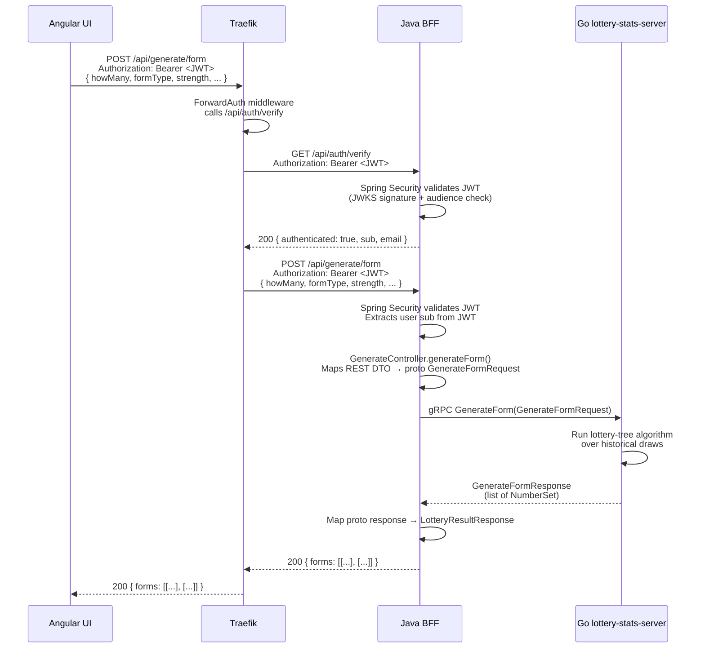
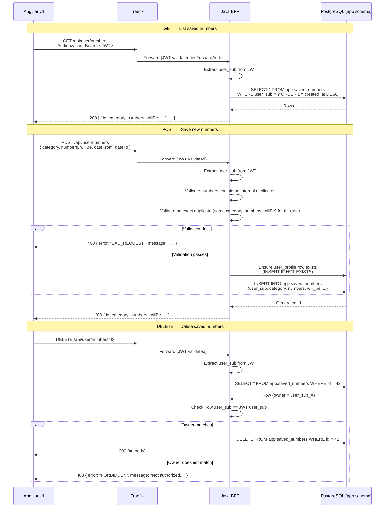
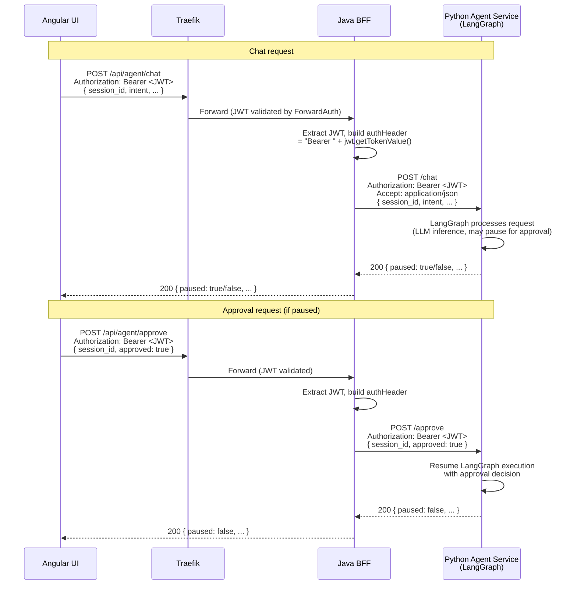
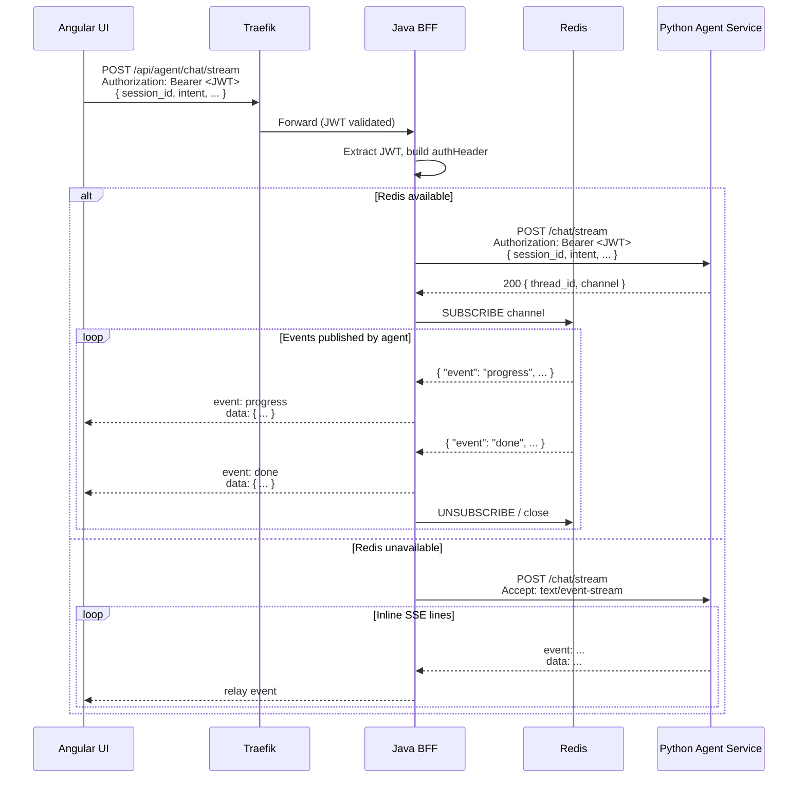
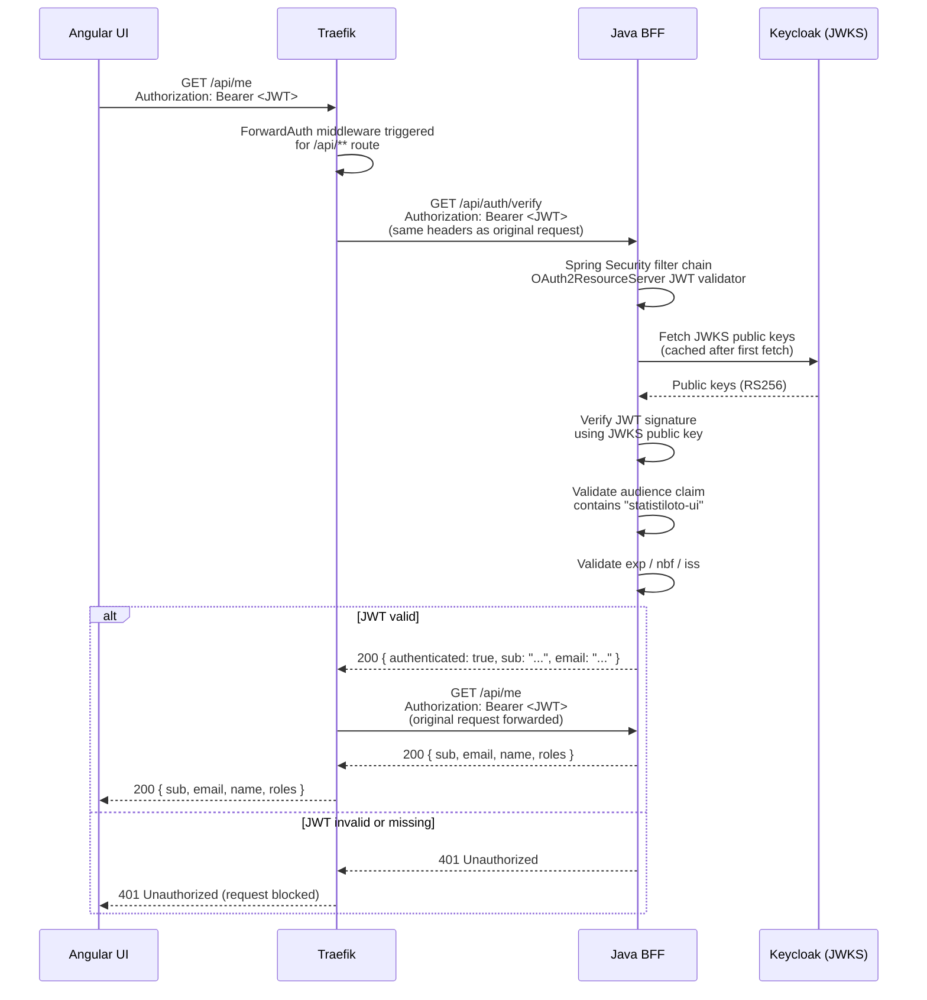
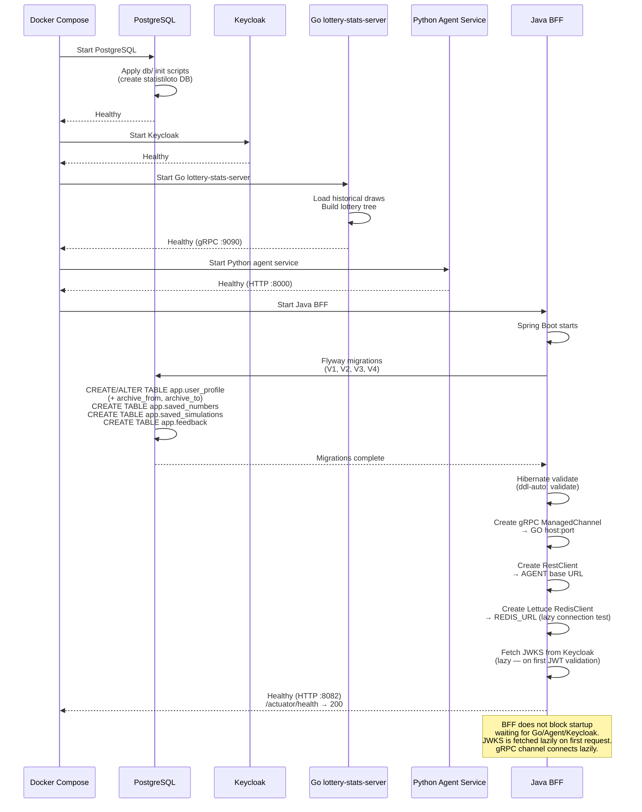

# Flows

## Request Flow: UI → Traefik → BFF → gRPC → Go

## Saved Numbers CRUD

## Agent Proxy

The BFF proxies all `/api/agent/*` requests to the Python agent service via HTTP,
forwarding the user's JWT Bearer token. `POST /api/agent/chat/stream` returns an SSE
stream; when `redis.url` is available the BFF uses Redis pub/sub, otherwise it falls
back to inline SSE.
The flow below shows the chat + HITL
approval cycle. The BFF also proxies session management (`/api/agent/sessions`
GET/DELETE), LLM config management (`/api/agent/llm-config` GET/PUT,
`/api/agent/llm-configs` CRUD + activate/test), telemetry (`/token-usage`,
`/audit-log`), RAG reindex, and model listing (`/llm-models`) — all follow the
same pattern: extract JWT → build `Authorization` header → forward to the agent
→ return the agent's JSON response. Admin endpoints are gated by
`@PreAuthorize("hasRole('ADMIN')")`. Upstream 4xx/5xx errors from the agent are
propagated to the caller as `UPSTREAM_ERROR` responses with the original status
code.

## Agent Chat Streaming (SSE)

## Auth Validation (ForwardAuth)

## Startup Sequence

